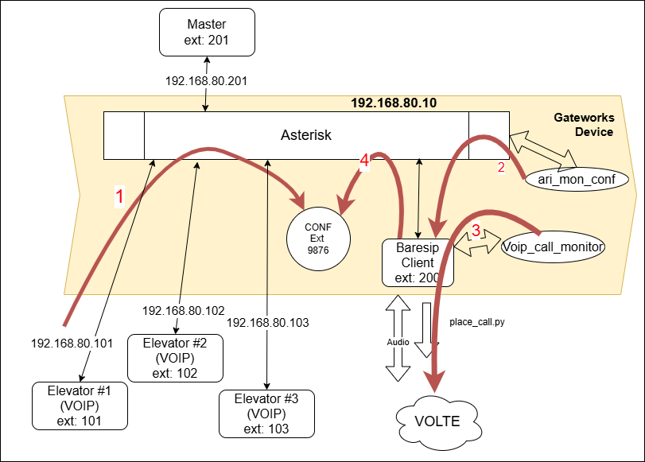

# Gateworks Venice Programming for VOIP solution

The Gateworks setup for the VOIP solution is different than that for the Pool
configuration. In the VOIP configuration the ethernet port eth0 is used to get Power
Over Ethernet(POE), and to connect to the POE switch. The second interface will be
needed to connect to the internet for installing update and packages.

## Setup

To be able to get to the system console on first powering up of the board, the JTAG
debugger will be needed.
It will allow the system console to be presented to the PC as a serial port.

## Connectivity

Connect the USB/Serial/JTAG debugger cable for the system console and let the board
boot normally the first time.
Login with root.

Connect eth1 to a network that has internet access.

If the ethernet eth1 interface doesn't come up and get an ip address.

```bash
root@noble-venice:~# ip addr show eth1
2: eth0: <BROADCAST,MULTICAST,UP,LOWER_UP> mtu 1500 qdisc mq state UP group default qlen 1000
    link/ether 00:d0:12:07:fa:02 brd ff:ff:ff:ff:ff:ff
    altname end0
    inet 172.20.10.71/24 brd 172.20.10.255 scope global dynamic noprefixroute eth0
       valid_lft 601249sec preferred_lft 525744sec
    inet6 fe80::d6dd:4eca:da70:827d/64 scope link
       valid_lft forever preferred_lft forever
```

The issue the following command

```bash
dhcpcd eth1
```

The interface eth0 is providing power and will be configured in a later step.

Make sure that eth1 has internet access.

Before running updates for the packages, make sure that the eth0 is disabled, or
the command below will fail because it will be going to a network interface that does
not have internet access.

## Configuration

Here is a diagram of the configuration being setup.



## Push VOIP phone scripts

To be able to push the voip setup scripts to the Gateworks board a user needs to be
created

```bash
adduser kuser
```

And create the user with a password. REMEMBER the password.

This user on the target needs to have some additional permissions granted.
These are for accessing the modem and gpios and provides some additional security since
the application is not being run as root.

```bash
usermod -aG dialout,audio,plugdev  kuser
```

To facilitate the copying of files,

```bash
 ssh-copy-id kuser@172.20.10.71
 # Or the correct address you have for the internet connected ethernet connection.
```

On the Gatworks target create the "/mnt/data/" directory.

```bash
mkdir /mnt/data
mkdir -p /mnt/data/sounds
mkdir -p /mnt/data/pulse
chmod ugo+w /mnt/data  /mnt/data/sounds  /mnt/data/pulse
```

## Packages

```bash
apt-get install -y baresip asterisk python3-serial microcom pulseaudio btop

# --fix-missing might be needed.
```

## Setup and Configuration

### Copy script to the target

There are several files that need to get to the target.
This is done by one of two methods. A tar file "INSERT NAME" can be copied into the
'/mnt/data' location and un-tar-ed there or the command from the development box
'just vpush' can be executed if the networking and justfile have been configured
correctly.

### Telit USB config

After microcom is installed (instructions above), connect to the device and
execute the following AT command to change the way the LE910 presents itself when
the device enumerates on the USB bus.

```bash
cp /mnt/data/99-ignore-modemmanager.rules  /etc/udev/rules.d/99-ignore-modemmanager.rules

microcom -p /dev/ttyUSB2 -s 115200

ATE1
OK
ATE#USBCFG=11
OK
```

The LE910 will reboot after this command is executed, so quit the microcom program
and reboot.


### PulseAudio

The following edits are appended to the '/etc/pulse/default.pa' file.

To determine what the "dash number" for the LE910 is, execute the following command.

```bash
kuser@noble-venice:/mnt/data$ pactl list sinks short
1       alsa_output.usb-Android_LE910C1-NF_0123456789ABCDEF-03.mono-fallback    module-alsa-card.c    s16le 1ch 16000Hz        SUSPENDED
```

In this case the "dash number" is -03 from the command above. This will be used in modifying
the default.pa file as shown below.
The version copied to the target **MAY** not match the hardware installed so editing
may be required.

```bash
set-card-profile alsa_card.usb-Android_LE910C1-NF_0123456789ABCDEF-03 output:mono-fallback+input:mono-fallback
set-default-sink alsa_output.usb-Android_LE910C1-NF_0123456789ABCDEF-03.mono-fallback
set-default-source alsa_input.usb-Android_LE910C1-NF_0123456789ABCDEF-03.mono-fallback
```

The daemon.conf file also needs to be edited the same way it was for the Pool config and
the adjustment to the sample-rates.

**NOTE:** The name of 'usb-Android_LE910C1-NF_0123456789ABCDEF-04' can be different
between different modem modules. Typically, the '-04' can change so make sure that
the modification of the 'default.pa' accounts for this difference.

### Baresip

The dialing script does not need to do any rerouting.

Edit the '.baresip/config' file to have the audio player set as shown below.

```bash
audio_driver            pulse
audio_player            pulse
audio_source            pulse
```

The file .baresip/accounts needs to have the following setup.

```bash
sip:200@192.168.80.10;auth_user=200;auth_pass=unsecurepassword;answermode=auto
```

**NOTE:** The client that runs on the target MUST be set to 'answermode=auto' for the
correct operation.

**NOTE:** some method of using authentication is needed because this is in the clear.

The service voip_call_monitor.service is responsible for starting the
voip_call_monitor_tcp.py script.

As root execute the following.
**NOTE:** For testing purposes the following line in the ' /mnt/data/voip_call_monitor.service'
 should be changed to call a phone for debugging purposes.

```bash
ExecStart=/usr/bin/python3 /mnt/data/voip_call_monitor_tcp.py -n <test number> -r
```

```bash
# Copy the service file to systemd directory
cp /mnt/data/voip_call_monitor.service /etc/systemd/system/.

# Reload systemd to recognize the new service
systemctl daemon-reload

# Enable the service to start on boot
systemctl enable voip_call_monitor.service

# Start the service now
systemctl start voip_call_monitor.service

# Check service status
systemctl status voip_call_monitor.service
```

To see any logging from the VOIP monitor the following command can be used.

```bash
# View logs
journalctl -u voip_call_monitor.service -f
```

### Asterisk

The asterisk server needs to know about the extensions in the '/etc/asterisk/pjsip.conf'
file.
An example is shown below.

```bash
[transport-udp]
type=transport
protocol=udp
bind=192.168.80.10:5060

;==============================================================================
; Templates - Define common settings once
;==============================================================================

; Template for all endpoints
[endpoint-template](!)
type=endpoint
context=from-internal
disallow=all
allow=ulaw
allow=alaw
direct_media=no
rtp_symmetric=yes
rewrite_contact=yes

; Template for all auth sections
[auth-template](!)
type=auth
auth_type=userpass
; Note: password must be set per extension for security

; Template for all AORs
[aor-template](!)
type=aor
max_contacts=8
remove_existing=yes
qualify_frequency=180

;==============================================================================
; Extensions - Unique values per extension
;==============================================================================

; Extension 101
[101](endpoint-template)
auth=101
aors=101

[101](auth-template)
username=101
password=unique_password_101

[101](aor-template)

; Extension 102
[102](endpoint-template)
auth=102
aors=102

[102](auth-template)
username=102
password=unique_password_102

[102](aor-template)

; Extension 103
[103](endpoint-template)
auth=103
aors=103

[103](auth-template)
username=103
password=unique_password_103

[103](aor-template)

; Extension 104
[104](endpoint-template)
auth=104
aors=104

[104](auth-template)
username=104
password=unique_password_104

[104](aor-template)

; These extensions have special roles in the system.

; Extension 200
[200](endpoint-template)
auth=200
aors=200

[200](auth-template)
username=200
password=unique_password_200

[200](aor-template)

; Extension 201 First Master phone.
[201](endpoint-template)
auth=201
aors=201

[201](auth-template)
username=201
password=unique_password_201

[201](aor-template)
```

**NOTE:** The authentication for the extensions loaded here need to match the
.baresip/accounts file.
**NOTE:** The passwords are in the clear!

The asterisk.service configuration needs to be modified to get it to start at boot
and handle calls. This is done by having a override.conf file in the
'/etc/systemd/system/asterisk.service.d/' directory.

```bash
cp asterisk.override.conf /etc/systemd/system/asterisk.service.d/override.conf
```

The contents of the override.conf file should be

```bash
[Unit]
Wants=network-online.target
After=network.target dev-ttyUSB2.device
Requires=dev-ttyUSB2.device


[Service]
ExecStartPre=/bin/sleep 10
ExecStartPost=/bin/bash -c "sleep 10; asterisk -rx 'core restart now'"
```

As 'root' run the following once the asterisk files are in place.

```bash
systemctl enable asterisk
systemctl start asterisk
```


## Setup of Viking phone

Load the Viking IP Programming V1.5.0 tool.
On the IP Settings page, the following needs to be set for the servers IP settings.
Server : 192.168.80.10
User Name: 101
Caller ID: 101
Password: <password from setup on Asterisk for this phone>

And in the device IP settings, the device should be configured for static IP and have
IP: 192.168.80.101 for the first extension (101)
Mask : 255.255.255.0
Gateway : 192.168.80.10  - this needs to be something that could be pinged.

And on the Phone Settings page, the following needs to be set
"In-Band Audio Call Progress": Disabled
