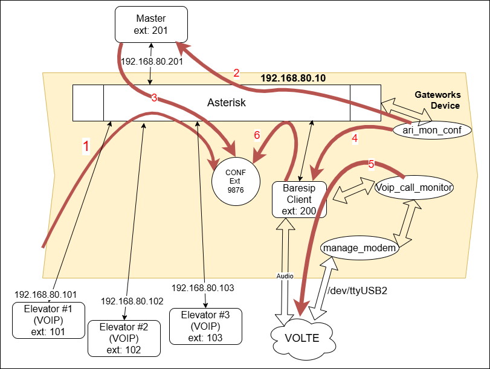
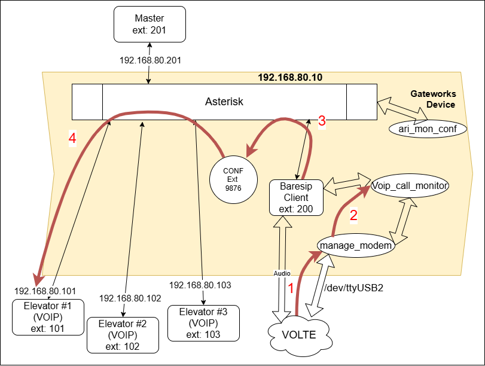

# Gateworks Venice Programming for VOIP solution

The Gateworks setup for the VOIP solution is different than that for the Pool
configuration. In the VOIP configuration the ethernet port eth0 is used to get Power
Over Ethernet(POE), and to connect to the POE switch. The second interface will be
needed to connect to the internet for installing update and packages.

## Setup

To be able to get to the system console on first powering up of the board, the JTAG
debugger will be needed.
It will allow the system console to be presented to the PC as a serial port.

**NOTE** For the Elevator setup the SOUND card must not be installed.

**NOTE** Make sure the Telit Modem is running the following firmware. The firmware
version can be retrieved with the #SWPKGV command, as shown.

```bash
AT#SWPKGV

25.21.664-P0F.664501
M0F.660014
P0F.664501
A0F.660014
```

## Connectivity

Connect the USB/Serial/JTAG debugger cable for the system console and let the board
boot normally the first time.
Login with root.

Connect eth1 to a network that has internet access.

If the ethernet eth1 interface doesn't come up and get an ip address.

```bash
root@noble-venice:~# ip addr show eth1
2: eth1: <BROADCAST,MULTICAST,UP,LOWER_UP> mtu 1500 qdisc mq state UP group default qlen 1000
    link/ether 00:d0:12:07:fa:02 brd ff:ff:ff:ff:ff:ff
    altname end1
    inet 172.20.10.71/24 brd 172.20.10.255 scope global dynamic noprefixroute eth0
       valid_lft 601249sec preferred_lft 525744sec
    inet6 fe80::d6dd:4eca:da70:827d/64 scope link
       valid_lft forever preferred_lft forever
```

The issue the following command

```bash
dhcpcd eth1
```

The interface eth0 is providing power and will be configured in a later step.

Make sure that eth1 has internet access.

\newpage
## Configuration

Here is a diagram of the configuration being setup.

### Centralized Modem Manager System

```bash
+-------------------+
| Incoming LTE Call |
|  (Whitelisted)    |
+---------+---------+
          |
          v
+----------------------+    TCP Socket (port 5555)
|  manage_modem.py     |<------------------------+
|  State Machine       |                         |
|  - Answer calls      |                         |
|  - Place calls       |                         |
|  - Forward DTMF      |                         |
+------+---------------+                         |
       |                                         |
       | AT Commands                             |
       v                                         |
+----------------------+                         |
|  LE910C1 Modem       |                         |
|  /dev/ttyUSB2        |                         |
|  - Voice calls       |                         |
|  - DTMF detection    |                         |
+----------------------+                         |
                                                 |
+----------------------+                         |
| voip_call_monitor    |-------------------------+
| - Monitors baresip   |                         |
| - Receives DTMF      |                         |
| - Forwards to VoIP   |                         |
+----------------------+                         |
                                                 |
+----------------------+                         |
| ari-mon-conf.py      |-------------------------+
| - Conference monitor |
| - 201->200 fallback  |
| - Extension detection|
+----------------------+
```

### How it works for Calling OUTBOUND



The diagram above shows the moving parts of the VOIP system.

1. A call to the conference number (9876) is placed by extension 101 and Asterisk
puts the caller in the conference call named 'elevator_conference'.
1. A script "listening" to the asterisk server "hears" the conference call being
established and dials the extension 201.
1. If extension 201 answers the call it is placed in the conference as the admin and the
call setup is complete. HOWEVER,
1. If extension 201 is not answered in 15 seconds, the listening script dials 200.
1. A script "listening" to the extension 200 client sees the incoming call which is
answered automatically, places the call to the number provided (EDC number).
1. Once connected the call is automatically added to the 'elevator_conference' as
the admin of the call.


Call Flow - Both calls stay active for audio bridge
```
1. Incoming VOIP call arrives
   -> Accept baresip call (CALL_ESTABLISHED)
   -> Request modem manager to place call

2. Modem call connects (status: success)
   -> Both calls are NOW ACTIVE
   -> Audio bridge is working
   -> Start background monitor thread

3. Background thread polls modem status every 2s
   -> Watches for call_active: false

4. Call termination (two scenarios):

   A. Modem call ends first:
      -> Monitor detects call_active: false
      -> Monitor hangs up baresip call
      -> Both calls cleaned up

   B. VOIP call ends first (CALL_CLOSED):
      -> Send hangup command to modem manager
      -> Modem manager terminates call
      -> Both calls cleaned up
```

### How it works for Calling INBOUND



Incoming Cellular Call Flow

1. An incoming call to the modem is answered IF the number is in the WHITELIST.
1. The manage_modem script informs that voip_call_monitor script that a call has been
received.
1. The voip_call_monitor script instructs baresip to place a call the the "elevator_conference"
and the extension is added as an Administrator in the conference. A menu that can be activated
by the DTMF tones is added to the admin user to allow the Admin to call extensions in the elevators.
1. Admin dials *5101 to call Elevator #1 (extension 101)
1. The Admin can add additional extensions as required.
1. The conference is terminated when the Admin leaves the conference.

``` markdown
1. Cell phone calls → manage_modem
   -> Checks whitelist
   -> Answers call
   -> Sets up audio bridge (cellular <-> PulseAudio)
   -> Broadcasts notification to subscribers

2. voip_call_monitor receives notification
   -> Extracts caller_number
   -> Makes baresip dial extension 9877

3. Baresip dials 9877
   -> Asterisk answers
   -> Joins elevator_conference as ADMIN (default_admin profile)

4. Audio flows:
   Cellular <-> PulseAudio <-> Baresip <-> ConfBridge <-> Elevators
```

## Installing OS Packages

Before running updates for the packages, make sure that the eth0 is disabled, or
the command below will fail because it will be going to a network interface that does
not have internet access.

```bash
apt-get install -y baresip asterisk python3-serial microcom pulseaudio btop \
    python3-aiohttp python3-dotenv lm-sensors bc

# --fix-missing might be needed.
```

## Installing Kings III SW package

There are two methods for moving the necessary scripts to the target board.
The first method, and easiest method is to copy (using scp or WinSCP) the VOIP
package tar file to the target. This method will be described first.
There is an alternate method used while in development which is described last.

With either method, the following is needed.
On the Gateworks target as root create the "/mnt/data/" directory using the system
console.

```bash
mkdir /mnt/data
mkdir -p /mnt/data/sounds
mkdir -p /mnt/data/pulse
chmod ugo+w /mnt/data  /mnt/data/sounds  /mnt/data/pulse
```

Create a user called "kuser" by doing the following and answering the prompts:

```bash
adduser kuser
```

And create the user with a password. REMEMBER the password.

This user on the target needs to have some additional permissions granted.
These are for accessing the modem and gpios and provides some additional security since
the application is not being run as root.

```bash
usermod -aG dialout,audio,plugdev  kuser
```

### Tarball Method

A tar file with the files to be installed can be used to install all the scripts and
configuration needed for the VOIP solution.

This method describes what is needed to be done using the tarball.

First get the tar file of the package to the system into the '/mnt/' directory.

A tar file "GW-VoIP-Setup.tgz" can be copied into the
'/mnt/data' location and un-tar-ed there. The un-tar command should be run as root.

```bash
cd /mnt/data
tar -zxf GW-VoIP-Setup.tgz
```

### Push Method

To be able to use the "Push Method" a tool called just is used to push the scripts to
'/mnt/data' directory. However, before that can be done the following is needed to
facilitate the scp operations without having to user the kusers password for each file
copied across.

```bash
ssh-copy-id kuser@172.20.10.71
# Or the correct address you have for the internet connected ethernet connection.
```

Also, to be able to push the voip setup scripts to the Gateworks board a user (kuser)
needs to be created, which should have been completed above.

The 'justfile' may need to be adjusted for the target IP with this method.

The command from the development box 'just vpkgpush' can be executed if the
networking and justfile have been configured correctly.

## Setup and Configuration

### Execute the config script on the target

Once the script "voip_config.sh" is present on the target, in the '/mnt/data'
directory, it can be run as root with.

```bash
./voip_config.sh
```

This script will put various files in the correct locations on the file system.
However, some of the files may still need adjustment. The next step is just one of
these adjustments.

**NOTE:** The command 'systemctl --user enable pulseaudio.service' still
needs to be executed as the user 'kuser'

### Telit USB config

After microcom is installed (instructions above), connect to the device and
execute the following AT command to change the way the LE910 presents itself when
the device enumerates on the USB bus.

```bash
cp /mnt/data/99-ignore-modemmanager.rules  /etc/udev/rules.d/99-ignore-modemmanager.rules

microcom -p /dev/ttyUSB2 -s 115200

ATE1
OK
AT#USBCFG=11
OK
```

The LE910 will reboot after this command is executed, so quit the microcom program
with Ctrl+X and reboot.

### PulseAudio

The following edits are appended to the '/etc/pulse/default.pa' file.

To determine what the "dash number" for the LE910 is, execute the following command,
'pactl list sinks short'. The output is shown below.

```bash
kuser@noble-venice:/mnt/data$ pactl list sinks short
1       alsa_output.usb-Android_LE910C1-NF_0123456789ABCDEF-03.mono-fallback    module-alsa-card.c    s16le 1ch 16000Hz        SUSPENDED
```

In this case the "dash number" is -03 from the command above. This will be used in
modifying the default.pa file as shown below.
The version copied to the target **MAY** not match the hardware installed so editing
may be required.

```bash
set-card-profile alsa_card.usb-Android_LE910C1-NF_0123456789ABCDEF-03 output:mono-fallback+input:mono-fallback
set-default-sink alsa_output.usb-Android_LE910C1-NF_0123456789ABCDEF-03.mono-fallback
set-default-source alsa_input.usb-Android_LE910C1-NF_0123456789ABCDEF-03.mono-fallback
```

**NOTE:** The name of 'usb-Android_LE910C1-NF_0123456789ABCDEF-04' can be different
between different modem modules. Typically, the '-04' can change so make sure that
the modification of the 'default.pa' accounts for this difference.

The '/etc/pulse/daemon.conf' file also needs to be edited the same way it was for the
Pool config and the adjustment to the sample-rates.
Here is what the values should be.

```bash
default-sample-rate = 48000
alternate-sample-rate = 16000
```

### Baresip

The dialing script does not need to do any rerouting.

Edit the '/home/kuser/.baresip/config' file to have the audio player set as shown below.
If the 'voip_config.sh' script ran successfully, these edits should already be present.

```bash
audio_driver            pulse
audio_player            pulse
audio_source            pulse
```

The file /home/kuser/.baresip/accounts needs to have the following setup.
This should be set correctly after the install, but it is something to check.

```bash
sip:200@192.168.80.10;auth_user=200;auth_pass=unsecurepassword;answermode=auto
```

**NOTE:** The client that runs on the target MUST be set to 'answermode=auto' for the
correct operation.

**NOTE:** some method of using authentication is needed because the authentication
 is in the clear text.

The service voip_call_monitor.service is responsible for starting the
voip_call_monitor_tcp.py script.

As root execute the following.
**NOTE:** For testing purposes the following line in the '/mnt/data/voip_call_monitor.service'
 should be changed to call a phone for debugging purposes.

```bash
ExecStart=/usr/bin/python3 /mnt/data/voip_call_monitor_tcp.py -n <test number> -r
```

```bash
# Copy the service file to systemd directory
cp /mnt/data/voip_call_monitor.service /etc/systemd/system/.

# Reload systemd to recognize the new service
systemctl daemon-reload

# Enable the service to start on boot
systemctl enable voip_call_monitor.service

# Start the service now
systemctl start voip_call_monitor.service

# Check service status
systemctl status voip_call_monitor.service
```

To see any logging from the VOIP monitor the following command can be used.

```bash
# View logs
journalctl -u voip_call_monitor.service -f
```

### Asterisk

The asterisk server needs to know about the following files.

```bash
/etc/asterisk/pjsip.conf
/etc/asterisk/modules.conf
/etc/asterisk/confbridge.conf
/etc/asterisk/extensions.conf
/etc/asterisk/ari.conf
/etc/asterisk/http.conf
```

These files are all part of the VOIP package and should be examined if changes are
needed to the configuration. These files are copied in as part of the 'voip_config.sh'
script, so there should be

**NOTE:** The authentication for the extensions loaded here need to match the
.baresip/accounts file.
**NOTE:** The passwords are stored in clear text!

The asterisk.service configuration needs to be modified to get it to start at boot
and handle calls. This is done by having a override.conf file in the
'/etc/systemd/system/asterisk.service.d/' directory.

```bash
cp asterisk.override.conf /etc/systemd/system/asterisk.service.d/override.conf
```

The contents of the override.conf file should be

```bash
[Unit]
Wants=network-online.target
After=network.target dev-ttyUSB2.device
Requires=dev-ttyUSB2.device


[Service]
ExecStartPre=/bin/sleep 10
ExecStartPost=/bin/bash -c "sleep 10; asterisk -rx 'core restart now'"
```

As 'root' run the following once the asterisk files are in place.

```bash
systemctl enable asterisk
systemctl start asterisk
```

## Asterisk REST Interface (ARI)

A service 'voip_ari_conference.service' is needed to monitor when calls enter the
'elevator_conference' so the Baresip connection can get dialed and the voice channel
connected. This should be installed by the 'voip_config.sh script. However, these are
the steps the script executes to start the service.

```bash
cp /mnt/data/voip_ari_conference.service /etc/systemd/system/.
systemctl daemon-reload
systemctl enable voip_ari_conference.service
systemctl start voip_ari_conference.service
```

## Configuration File

The '/mnt/data/K3_config_settings'  file is used for information about the
site/installation. The format of the file is a text file that contains name value pairs
in the format 'MDL="Q01"' Where MDL is the variable and "Q01" is the value associated
with the variable. Currently the defaults for this file are as follows:

```bash
CID="5822460189"
AC="C12345"
MDL="Q01"
APN="broadband"
UTM="02EBA09E"
bat_voltage="1323"

WHITELIST="9723256826,9724620611,8668073545,9729560535,9729560536"
MASTER_ANSWER_TO="15"
ENABLE_AUDIO_ROUTING="OFF"
```

The bat_voltage and UTM and APN will eventually be read in real time and removed from
the config file.

This file can be edited during installation to report back the desired information.

The variable 'WHITELIST' is used to control which incoming call numbers will be answered.

The ENABLE_AUDIO_ROUTING is used to define whether or not the audio loop back is needed. (This is
currently untested in the pool config.)

## Setup of Viking phone

Load the Viking IP Programming V1.5.0 tool.
On the IP Settings page, the following needs to be set for the servers IP settings.
Server : 192.168.80.10
User Name: 101
Caller ID: 101
Password: <password from setup on Asterisk for this phone>

And in the device IP settings, the device should be configured for static IP and have
IP: 192.168.80.101 for the first extension (101)
Mask : 255.255.255.0
Gateway : 192.168.80.10  - this needs to be something that could be pinged.

And on the Phone Settings page, the following needs to be set
"In-Band Audio Call Progress": Disabled

## Building A  VOIP Package

These are the steps that are needed to build a package.
Make sure that all the file are committed into the repo.
Apply a tag of the form Vmm.nn.pp  where mm = major version, nn = minor version and
pp = patch level.
Once the tag is applied, then execute the command

```bash
just version
```

Once that is complete, then executed

```bash
just pkgvoip
```

The build process is a bit fragile, so don't run these to commands together on the
same command line.

## Updating Procedure

**TODO : ** Add instructions on how to update when you have a tar file on the system.


## Implementation Details

Cellular Call -> Modem (#DTMFEV: *,1)
               |
manage_modem.py (detects & broadcasts)
               |
TCP notification: {"type": "dtmf_received", "digit": "*"}
               |
voip_call_monitor_tcp_new.py (receives notification)
               |
Baresip command: {"command": "dtmf", "params": "*"}
               |
Asterisk ConfBridge (receives DTMF via RTP)
               ↓
elevator_admin_menu triggers (*5 or 5 → addcallers context)
